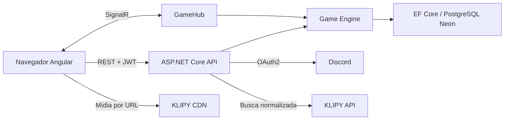
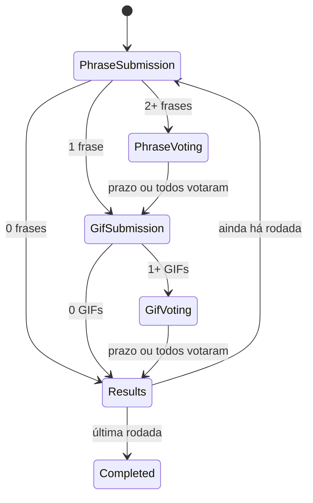

# GifJam - Product Requirements Document

## 1. Visão Geral

GifJam é um party game web privado para 2 a 6 amigos em uma call do Discord. O grupo cria frases, escolhe anonimamente uma delas e responde com GIFs. Cada jogador vota no GIF favorito sem conhecer o autor; os votos formam o ranking acumulado.

O MVP deve validar diversão, ritmo e intenção de repetir. Uma partida de 3 rodadas deve normalmente terminar em até 15 minutos. O host pode escolher de 3 a 6 rodadas, aceitando duração maior nas opções longas.

## 2. Objetivos e Não Objetivos

### Objetivos

- Permitir que um grupo inicie uma partida pelo navegador em poucos minutos.
- Manter todos sincronizados sem recarregar a página.
- Garantir anonimato e regras no backend.
- Recuperar a sessão após queda breve de conexão.
- Medir conclusão, duração e intenção de jogar novamente.

### Não Objetivos

- Suportar desconhecidos, matchmaking ou moderação pública.
- Construir bot, Discord Activity, chat ou voz.
- Preservar histórico permanente de partidas.
- Escalar horizontalmente no MVP.
- Monetizar o produto.

## 3. Personas

### Host

Pessoa que sugere a brincadeira durante uma call, cria a sala, compartilha o link, escolhe o número de rodadas e inicia quando o grupo está pronto. Quer configuração mínima e início rápido.

### Jogador

Amigo convidado pelo link. Quer entrar sem criar outro cadastro, entender o estado atual, responder rapidamente e acompanhar a revelação e o ranking.

## 4. User Stories

- Como host, quero criar uma sala privada para convidar apenas meus amigos.
- Como host, quero escolher entre 3 e 6 rodadas para adequar a duração ao grupo.
- Como jogador, quero entrar com minha conta Discord para usar um nome e avatar familiares.
- Como jogador, quero marcar que estou pronto para que o host saiba quando começar.
- Como jogador, quero escrever uma frase sem revelar minha autoria para evitar viés.
- Como jogador, quero votar em uma frase alheia para escolher o prompt da rodada.
- Como jogador, quero pesquisar GIFs em português e escolher um rapidamente.
- Como jogador, quero votar em um GIF alheio sem saber o autor.
- Como jogador, quero ver autores, votos e ranking após a votação.
- Como jogador desconectado, quero retornar à partida com o estado correto.

## 5. Regras do Produto

### 5.1 Sala e Lobby

- Código com 5 caracteres maiúsculos, sem `0/O` e `1/I`, único entre salas ativas.
- Sala aceita de 2 a 6 jogadores autenticados.
- Host conta como pronto; os demais alternam pronto/aguardando.
- Host inicia somente com 2 ou mais jogadores e todos os convidados prontos.
- Novos jogadores não entram depois do início; membros existentes podem reconectar.
- Se o host sair no lobby, a sala é encerrada. Se desconectar, a sala aguarda seu retorno.

### 5.2 Rodada

Fases e limites máximos:

1. Envio de frase: 30 segundos.
2. Votação da frase: 20 segundos.
3. Escolha de GIF: 60 segundos.
4. Votação do GIF: 20 segundos.
5. Resultado: 15 segundos antes da próxima rodada.

Cada fase de entrada avança antes do prazo quando todos os jogadores conectados e elegíveis concluem a ação. O backend fornece `serverTime` e `phaseEndsAt`; o cliente apenas exibe a contagem regressiva.

### 5.3 Frases

- Uma frase por jogador por rodada, com 1 a 180 caracteres após `trim`.
- Frases aparecem em ordem embaralhada e sem identificadores de autor.
- Um voto por jogador; voto na própria frase é rejeitado.
- Empate é resolvido aleatoriamente no backend entre as mais votadas.
- Com uma única frase válida, ela é selecionada sem votação.
- Sem frases válidas, a rodada é marcada sem participação e avança sem pontos.

### 5.4 GIFs

- Pesquisa disponível apenas durante a fase de escolha para participantes da sala.
- Cada resultado inclui um `selectionToken` curto e assinado pela API; o cliente envia esse token, não URLs livres.
- Um GIF por jogador por rodada; reenvio antes do encerramento substitui a escolha.
- A grade de votação mostra todas as submissões simultaneamente e embaralhadas.
- Um voto favorito por jogador; voto no próprio GIF e voto duplicado são rejeitados.
- Cada voto recebido vale 1 ponto no ranking geral.
- Empates compartilham a mesma posição; não há sorteio nem bônus de vitória.
- Com dois jogadores e duas submissões, o empate esperado é comportamento normal.

### 5.5 Anonimato

- Antes do resultado, DTOs de frase e GIF não incluem `UserId`, username, display name ou avatar.
- O jogador pode saber qual envio é o próprio apenas por um campo direto e privado como `isOwn`; essa informação não é transmitida aos demais.
- No resultado, o backend envia a autoria da frase escolhida e de todos os GIFs.
- Inspecionar a rede ou o estado do Angular não pode revelar autores antecipadamente.

### 5.6 Presença e Reconexão

- SignalR atualiza presença, mas a identidade do membro vem do token autenticado.
- Jogador desconectado não bloqueia avanço antecipado; ainda pode retornar até o prazo da fase.
- Ao reconectar, recebe snapshot filtrado da fase atual e suas ações já registradas.
- A partida continua sem o host depois de iniciada.
- Um reinício da API recupera fase e prazo do PostgreSQL; prazos vencidos são processados na retomada.

## 6. Casos de Borda

| Caso | Comportamento |
|---|---|
| Código inexistente/expirado | Retornar 404 e manter opção de tentar outro código |
| Sala cheia | Retornar 409 |
| Partida já iniciada | Bloquear novo membro; permitir reconexão de membro existente |
| Comando fora da fase | Rejeitar sem alterar estado e sincronizar snapshot atual |
| Envio/voto repetido | Tratar idempotentemente quando igual; rejeitar conflito encerrado |
| Voto próprio | Retornar erro de regra de negócio |
| Todos respondem cedo | Encerrar fase imediatamente em transação única |
| Nenhum responde | Encerrar pelo prazo e avançar com rodada sem pontos |
| KLIPY indisponível | Exibir erro recuperável; cronômetro continua |
| GIF deixa de carregar | Mostrar placeholder e manter a opção identificável para voto |
| Empate de frase | Escolha aleatória entre empatadas |
| Empate de GIF/final | Compartilhar posição e pontos |
| Duas transições concorrentes | Lock por partida e verificação de versão impedem avanço duplo |

## 7. Arquitetura do MVP



### 7.1 Princípios

- Monólito modular com uma API e uma SPA; sem microserviços ou repositório genérico.
- PostgreSQL é a fonte persistente de verdade.
- `GameEngine` serializa comandos por partida com lock em processo e transações EF Core.
- `RoundScheduler` usa `BackgroundService` para prazos e recupera partidas abertas na inicialização.
- Uma réplica da API no MVP; escala horizontal futura exigirá um serviço de realtime/Redis e lock distribuído.
- Eventos SignalR notificam mudanças; o cliente pode solicitar novo snapshot a qualquer momento.

### 7.2 Hospedagem

- Angular estático na Vercel.
- API em uma VPS Hostinger, com uma réplica e container Docker.
- PostgreSQL no Neon Free com conexão TLS e pooling Npgsql.
- Domínios do frontend e API configurados explicitamente no CORS.
- Segredos somente no ambiente da API: Discord client secret, KLIPY key, JWT signing key e connection string.

## 8. Estrutura do Frontend

```text
frontend/
  src/app/
    core/
      api/
      auth/
      guards/
      realtime/
    features/
      home/
      auth-callback/
      room/
        lobby/
        phrase-submit/
        phrase-vote/
        gif-search/
        gif-vote/
        round-result/
        final-ranking/
    shared/
      ui/
      models/
      utilities/
    app.config.ts
    app.routes.ts
  public/
  styles.css
```

- Angular 22 com standalone components, signals para estado local e lazy routes.
- `GameStore` mantém o snapshot atual; somente eventos/consultas do backend o atualizam.
- `RealtimeService` gerencia conexão, reconexão e ressincronização.
- `spartan/ui`, Tailwind e Lucide fornecem componentes, tokens e ícones.

## 9. Estrutura do Backend

```text
backend/
  src/GifJam.Api/
    Features/
      Auth/
      Games/
      Gifs/
    GameEngine/
      GameCoordinator.cs
      GameStateProjector.cs
      RoundScheduler.cs
    Realtime/
      GameHub.cs
      Contracts/
    Domain/
      Entities/
      Enums/
      Rules/
    Data/
      AppDbContext.cs
      Configurations/
      Migrations/
    Integrations/
      Discord/
      Klipy/
    Common/
      Auth/
      Errors/
      Time/
    Program.cs
  tests/GifJam.Api.Tests/
```

- .NET 10 LTS, ASP.NET Core, EF Core e Npgsql.
- Features concentram endpoint, DTO, validação e serviço relacionado.
- `DbContext` é usado diretamente pelos serviços; não criar `GenericRepository`.
- Erros REST usam RFC 9457 `ProblemDetails` com `code`, `detail` e `traceId`.

## 10. Modelo de Dados

### User

`Id`, `DiscordId` único, `Username`, `DisplayName`, `AvatarUrl`, `CreatedAt`, `UpdatedAt`.

### AuthExchangeCode

`Id`, `CodeHash` único, `UserId`, `ExpiresAt`, `ConsumedAt`. O código dura 60 segundos e só pode ser usado uma vez.

### Game

`Id`, `Code` único, `HostUserId`, `Status`, `TotalRounds`, `CurrentRoundNumber`, `Version`, `CreatedAt`, `StartedAt`, `FinishedAt`.

### GamePlayer

Chave composta `GameId + UserId`; `Score`, `IsReady`, `IsConnected`, `JoinedAt`, `LastSeenAt`.

### Round

`Id`, `GameId`, `RoundNumber`, `Phase`, `SelectedPhraseId`, `PhaseEndsAt`, `StartedAt`, `FinishedAt`. Índice único em `GameId + RoundNumber`.

### Phrase

`Id`, `RoundId`, `UserId`, `Text`, `SubmittedAt`. Índice único em `RoundId + UserId`.

### PhraseVote

`Id`, `RoundId`, `PhraseId`, `UserId`, `CreatedAt`. Índice único em `RoundId + UserId`.

### GifSubmission

`Id`, `RoundId`, `UserId`, `Provider`, `ExternalId`, `PreviewUrl`, `MediaUrl`, `SourceUrl`, `Attribution`, `SubmittedAt`. Índice único em `RoundId + UserId`. Não armazenar binário do GIF.

Os metadados são necessários para reconstruir a rodada, manter o envio após reconexão e exibir atribuição. São removidos com a partida após 24 horas.

### GifVote

`Id`, `RoundId`, `GifSubmissionId`, `UserId`, `CreatedAt`. Índice único em `RoundId + UserId`.

### Enums

- `GameStatus`: `Lobby`, `InProgress`, `Finished`, `Closed`.
- `RoundPhase`: `PhraseSubmission`, `PhraseVoting`, `GifSubmission`, `GifVoting`, `Results`, `Completed`.

## 11. API REST

Todas as respostas privadas exigem `Authorization: Bearer <token>`.

| Método e rota | Finalidade |
|---|---|
| `GET /api/auth/discord/start?returnUrl=` | Criar `state` e redirecionar ao Discord |
| `GET /api/auth/discord/callback` | Trocar código Discord, atualizar usuário e redirecionar com código de troca |
| `POST /api/auth/exchange` | Consumir código único e retornar JWT de 8 horas + usuário |
| `GET /api/auth/me` | Retornar usuário autenticado |
| `POST /api/games` | Criar sala com `totalRounds` entre 3 e 6 |
| `POST /api/games/{code}/join` | Entrar ou recuperar vínculo existente |
| `POST /api/games/{code}/leave` | Sair do lobby; durante jogo, marcar desconectado |
| `GET /api/games/{code}` | Obter snapshot filtrado para o jogador |
| `GET /api/games/{code}/gifs/search?q=&cursor=` | Retornar até 24 GIFs normalizados em `pt-BR` |
| `GET /health/live` | Verificar processo |
| `GET /health/ready` | Verificar API e banco |

`GifSearchItem` contém `provider`, `id`, `previewUrl`, `mediaUrl`, `width`, `height`, `sourceUrl`, `attribution` e `selectionToken`. O token assina os metadados, a sala e uma expiração de 2 minutos; `SubmitGif` só persiste os dados extraídos de um token válido. A chave da KLIPY nunca chega ao Angular. Aplicar debounce no frontend e limite de 10 pesquisas por minuto por usuário.

## 12. Contrato SignalR

Hub autenticado em `/hubs/game`. Cada comando recebe `gameCode` e retorna confirmação ou erro tipado.

### Métodos do Cliente para o Servidor

- `SubscribeGame(gameCode)`
- `SetReady(gameCode, isReady)`
- `StartGame(gameCode)`
- `SubmitPhrase(gameCode, text)`
- `VotePhrase(gameCode, phraseId)`
- `SubmitGif(gameCode, selectionToken)`
- `VoteGif(gameCode, submissionId)`
- `RequestSync(gameCode)`

### Eventos do Servidor para o Cliente

- `StateSynced(playerGameSnapshot)`
- `LobbyUpdated(lobbySnapshot)`
- `PresenceChanged(presenceSnapshot)`
- `PhaseChanged(roundPhaseSnapshot)`
- `SubmissionProgress({completed, eligible})`
- `RoundRevealed(roundResult)`
- `RankingUpdated(ranking)`
- `GameFinished(finalRanking)`
- `CommandRejected({code, message, currentPhase})`

Snapshots de votação são projetados por jogador para incluir `isOwn`, mas nunca dados do autor de outros envios. O SignalR usa o mesmo JWT via `accessTokenFactory`.

## 13. Fluxo de Autenticação Discord

1. Angular guarda em `sessionStorage` a intenção de criar sala ou entrar por código.
2. Navegador abre `/api/auth/discord/start`; API valida `returnUrl` contra rotas relativas permitidas, cria `state` assinado e redireciona ao Discord.
3. Discord retorna ao callback da API com `code` e `state`.
4. API valida `state`, troca o código com o client secret e consulta identidade básica.
5. API cria/atualiza `User` apenas com os campos aprovados.
6. API cria um código aleatório de uso único, salva somente o hash e redireciona ao frontend.
7. Angular envia o código a `/api/auth/exchange` e recebe JWT de 8 horas.
8. JWT fica em `sessionStorage`; não há refresh token no MVP. Logout limpa a sessão local.

Essa troca evita colocar token duradouro na URL e evita depender de cookie entre os domínios gratuitos.

## 14. Fluxo Completo de Uma Rodada



Cada transição é uma transação que verifica `Game.Version`, grava fase/prazo, calcula resultados quando necessário e só então publica o evento SignalR. Após 15 segundos de resultado, o servidor inicia a próxima rodada; a tela de ranking final permanece até o usuário sair.

## 15. Requisitos Não Funcionais

### Segurança e Privacidade

- HTTPS obrigatório, OAuth `state`, JWT assinado e validação de issuer/audience/expiração.
- CORS somente para os domínios configurados.
- Rate limiting em autenticação, criação/entrada de sala e busca de GIF.
- Validação no backend para fase, membro, autoria, duplicidade e limites de texto.
- Token de seleção impede URL, autoria ou atribuição de GIF adulterada pelo cliente.
- Filtro de conteúdo apropriado configurado no Partner Panel da KLIPY.
- Logs não incluem tokens, client secrets, texto das frases ou URLs com credenciais.
- Usuários persistem; jogos, votos e submissões são removidos após 24 horas.

### Desempenho e Confiabilidade

- p95 abaixo de 500ms para comandos internos, excluindo cold start e KLIPY.
- Busca externa com timeout de 5 segundos e uma nova tentativa apenas para falha transitória.
- Estado de fase e prazo persistidos antes da publicação de eventos.
- Idempotência por restrições únicas e verificação da fase.

### Experiência e Acessibilidade

- Suporte às versões atuais de Chrome, Edge, Firefox e Safari cobertas pelo Angular 22.
- WCAG AA para contraste, foco e navegação por teclado.
- Layout funcional a partir de 320px e em desktop.
- `prefers-reduced-motion` respeitado; GIFs não podem provocar salto de layout.

## 16. Critérios de Aceitação por Feature

### Autenticação

- Login válido cria ou atualiza o mesmo usuário pelo `DiscordId`.
- `state` inválido, código expirado ou código reutilizado não cria sessão.
- Apenas os quatro dados Discord aprovados são persistidos.

### Sala

- Código e link levam à mesma sala.
- Sétimo jogador recebe sala cheia.
- Host não inicia com menos de 2 jogadores ou convidado não pronto.
- Jogador existente reconecta; visitante novo não entra em jogo iniciado.

### Frase e Voto

- Servidor aceita no máximo uma frase por jogador/rodada.
- Ordem é embaralhada e autoria não está no payload.
- Voto próprio e segundo voto são recusados.
- Empate produz uma das frases empatadas, nunca outra.

### GIF e Voto

- Busca não expõe a chave KLIPY e mostra atribuição obrigatória.
- Token de seleção expirado, adulterado ou emitido para outra sala é recusado.
- Envio armazena apenas metadados necessários, nunca o arquivo.
- Cada jogador vota uma vez e não vota no próprio GIF.
- Cada voto soma exatamente um ponto; empates mantêm a mesma posição.

### Tempo Real

- Todos os clientes conectados recebem mudança de fase e ranking sem recarregar.
- Fase avança cedo quando todos os elegíveis concluem.
- Reconexão restaura fase, prazo, score e ação já enviada.
- Payload anônimo não contém campos de autoria antes do resultado.

## 17. Estratégia de Testes

- Unitários: regras de fase, timers, elegibilidade, votos, empates, score e projeção anônima.
- Integração: PostgreSQL via Testcontainers, endpoints OAuth simulados, KLIPY simulada e `GameHub` com `WebApplicationFactory`.
- Frontend: stores, guards, componentes de fase, cronômetro e estados de erro com Vitest.
- E2E Playwright: partidas com 2, 3 e 6 contextos de navegador; avanço por conclusão e timeout; empate; queda/reconexão; bloqueio de voto próprio; ranking final.
- Segurança: inspecionar respostas REST e SignalR para provar ausência de autoria antes da revelação.
- Responsividade: validar 320x568, 390x844, 768x1024 e 1440x900 sem sobreposição.

## 18. Ordem Recomendada de Implementação

1. Criar solução .NET, Angular, configuração local e PostgreSQL.
2. Implementar modelo EF Core, migração inicial e relógio testável.
3. Implementar OAuth Discord, JWT e guard Angular.
4. Implementar criação/entrada de sala, lobby e presença SignalR.
5. Implementar máquina de estados e fase de frases com testes.
6. Integrar KLIPY por interface `IGifProvider` e construir busca/seleção.
7. Implementar votação de GIF, revelação, score e ranking final.
8. Implementar reconexão, recuperação de prazo e limpeza de partidas.
9. Finalizar experiência responsiva, acessibilidade e estados de falha.
10. Executar E2E, publicar Vercel/Hostinger/Neon e realizar as 5 partidas de validação.

## 19. Primeira Versão Jogável

O primeiro corte funcional termina no item 5: dois jogadores autenticam, criam/entram em uma sala, ficam prontos e completam uma rodada usando URLs de GIF de teste. Em seguida, a integração KLIPY substitui os dados de teste e o ranking fecha o loop real do produto. Esse corte valida OAuth, lobby, SignalR, máquina de estados e anonimato antes de investir no acabamento.
